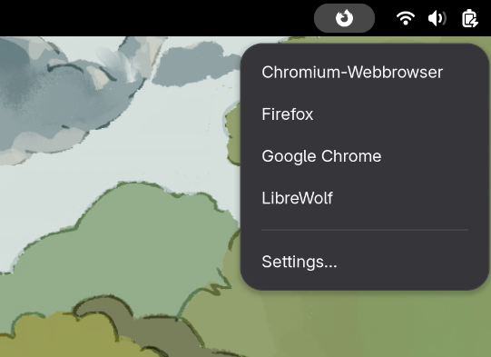
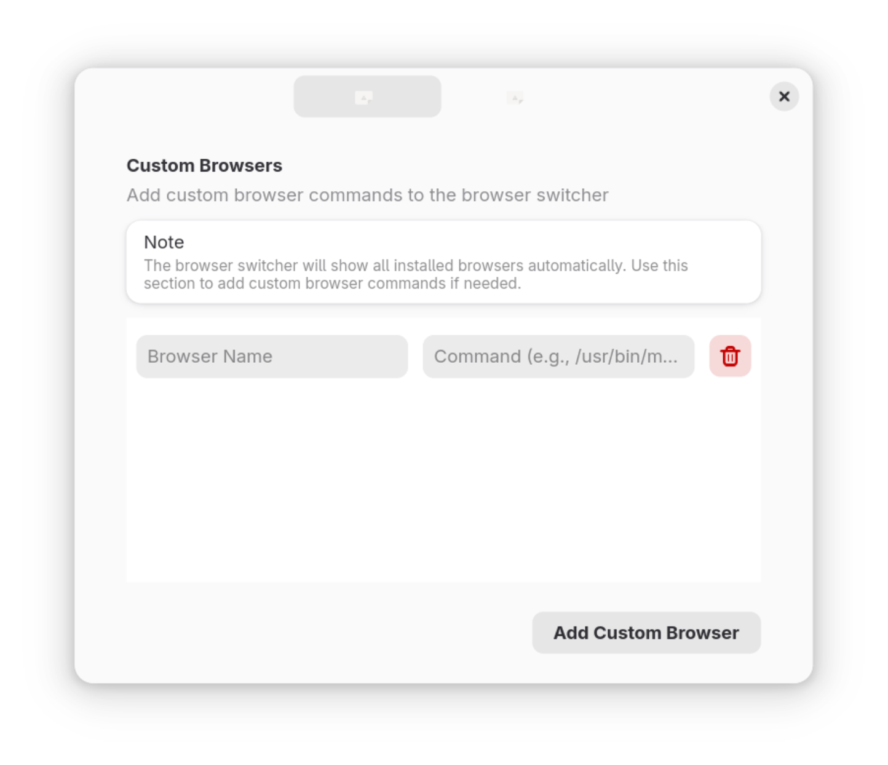
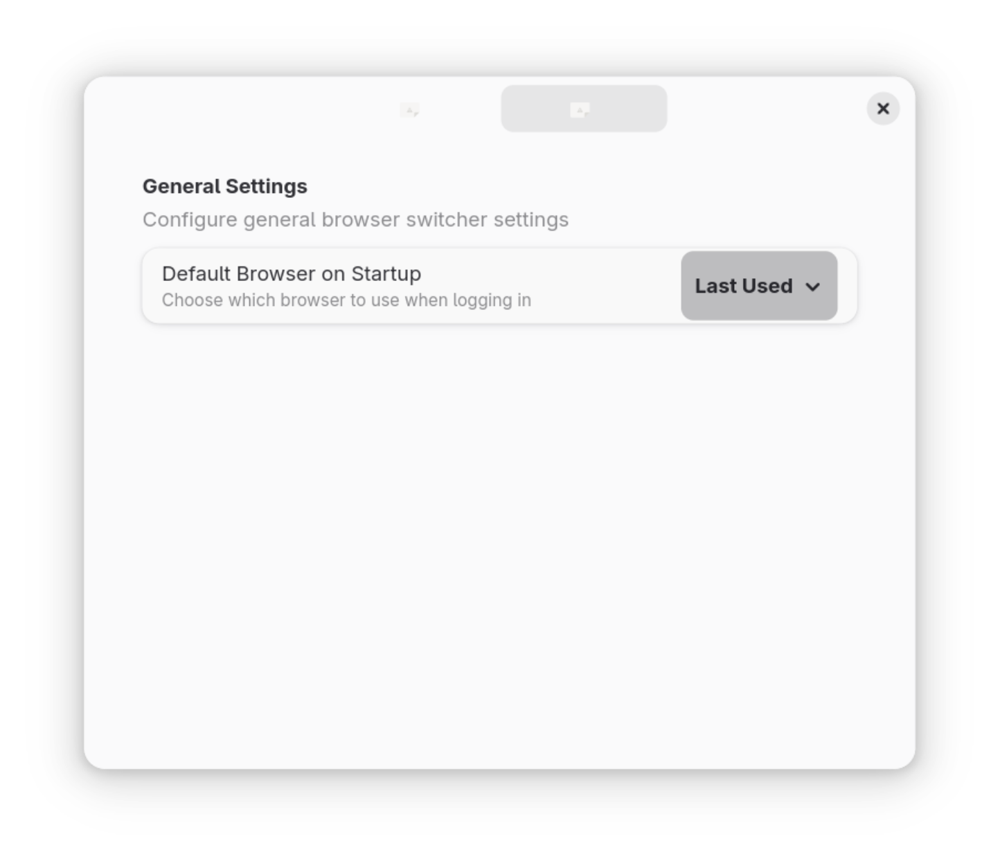

# Browser Switcher

A GNOME Shell extension that allows you to quickly switch your default web browser from the top bar.

## Features

- **Quick Browser Switching**: Click the icon in the top bar to see all installed browsers
- **Auto-Detection**: Automatically detects all installed browsers (native packages and Flatpak apps)
- **Custom Browsers**: Add custom browser commands in the settings
- **Visual Feedback**: Icon shows which browser is currently set as default
- **Command Validation**: Visual warning for invalid custom browser commands
- **Startup Configuration**: Choose to use the last selected browser or system default on startup

## Installation

### From extensions.gnome.org (Recommended)
1. Visit [extensions.gnome.org](https://extensions.gnome.org/)
2. Search for "Browser Switcher"
3. Click the toggle to install

### Manual Installation
```bash
git clone https://github.com/deliarmin/browser-switcher.git
cd browser-switcher
./install.sh
```

## Usage

1. **Switch Browser**: Click the extension icon in the top bar and select a browser from the list
2. **Add Custom Browser**: 
   - Click the icon -> Settings
   - Click "Add Custom Browser"
   - Enter name and command (e.g., `/usr/bin/mybrowser %u`)
3. **Remove Custom Browser**: Click the trash icon next to the browser in settings

## Supported Browsers

The extension automatically detects:
- Firefox
- Google Chrome
- Chromium
- Brave
- Vivaldi
- Epiphany (GNOME Web)
- LibreWolf
- Microsoft Edge
- Opera
- Any browser registered as an HTTP/HTTPS handler
- Custom browser commands

## Requirements

- GNOME Shell 48 (might work on older versions as well, but has not been tested)
- `xdg-settings` (usually pre-installed)

## Screenshots




## Contributing

Contributions are welcome! Please feel free to submit a Pull Request.

## License

This extension is licensed under the GPL-3.0 License.

## Support

If you encounter any issues, please report them on the [GitHub Issues](https://github.com/deliarmin/browser-switcher/issues) page.
